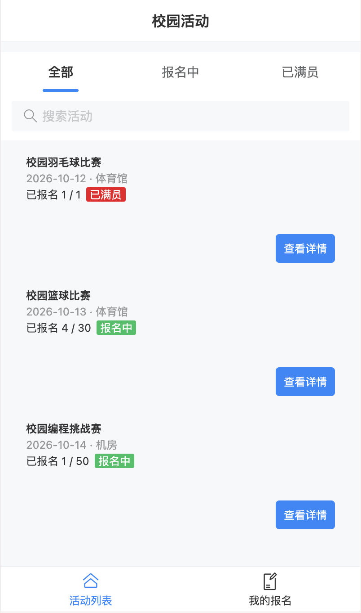
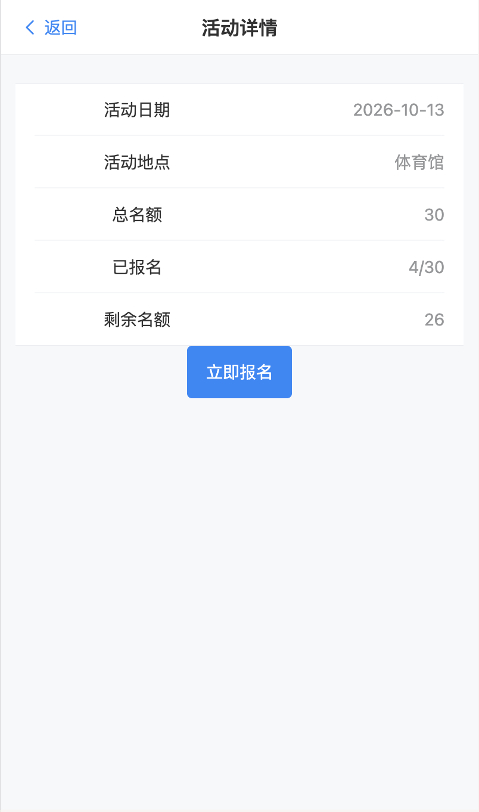
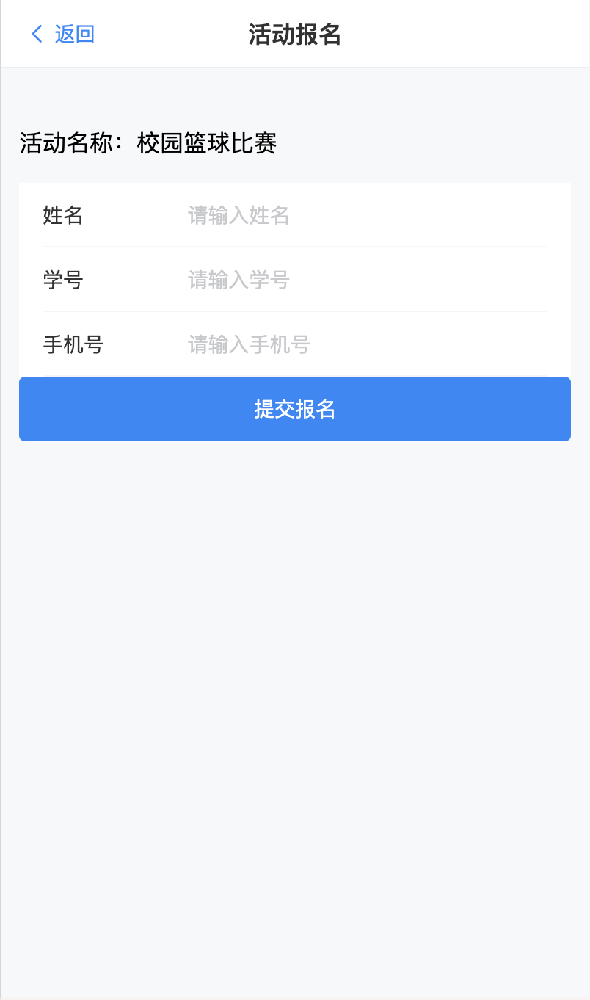
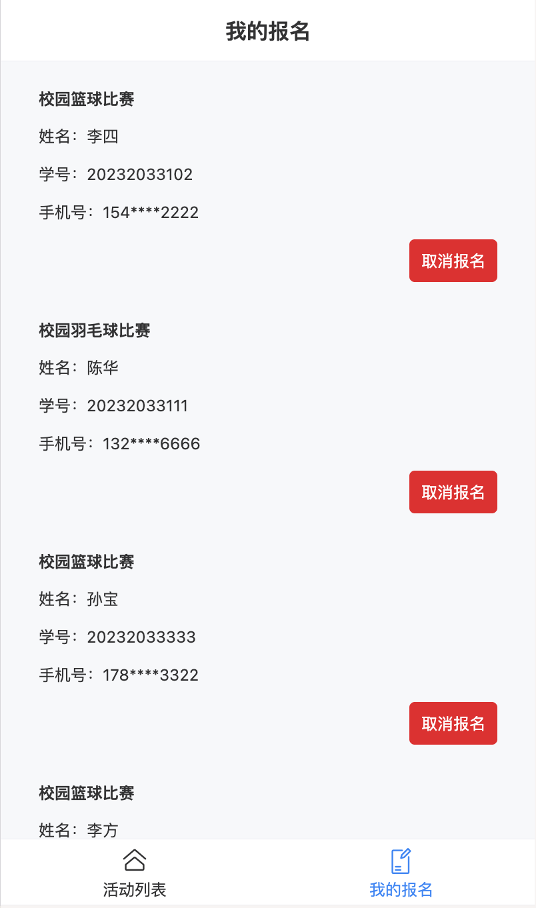

# 校园活动报名 H5

基于 Vue 3 开发的移动端校园活动报名系统，主要用于活动浏览、活动报名、报名记录管理等场景。

项目使用 Vue Router 实现页面路由，Pinia 管理报名状态，并结合 localStorage 实现数据持久化，UI 基于 Vant 组件库完成。

## 项目功能

### 活动列表
- 展示活动名称、时间、地点、报名人数及总名额
- 支持活动名称搜索
- 支持“全部 / 报名中 / 已满员”状态筛选
- 根据报名人数动态显示活动状态

### 活动详情
- 展示活动时间、地点、总名额、已报名人数、剩余名额
- 名额已满时自动禁用报名按钮
- 支持跳转至活动报名页面

### 活动报名
- 使用 Vant Form / Field 实现移动端报名表单
- 支持姓名、学号、手机号录入
- 校验必填项和手机号格式
- 防止同一学号重复报名同一活动
- 活动满员后阻止继续提交报名

### 我的报名
- 展示用户报名记录
- 手机号脱敏显示
- 支持取消报名
- 取消报名前进行二次确认
- 无报名记录时显示空状态

### 数据持久化
- 使用 Pinia 管理报名数据
- 使用 localStorage 保存报名记录
- 页面刷新后报名数据仍然保留

## 技术栈

- Vue 3
- JavaScript
- Vite
- Vue Router
- Pinia
- Vant
- localStorage

## 核心实现

### 活动筛选

通过 `ref` 保存当前筛选状态与搜索关键字，通过 `computed` 和 `filter` 动态计算需要展示的活动列表。

活动状态筛选支持：

- 全部
- 报名中
- 已满员

同时支持按照活动名称进行搜索，并与状态筛选组合使用。

### 报名状态管理

通过 Pinia 集中维护报名数据，并在新增和删除报名记录时同步更新 localStorage。

主要包括：

- 新增报名记录
- 删除报名记录
- 页面间共享报名状态
- 页面刷新后恢复报名数据

### 报名人数计算

通过活动 `id` 与报名记录中的 `activityId` 进行匹配，并使用 `filter()` 和 `.length` 动态统计当前活动报名人数。

根据：

```text
总名额 - 已报名人数
```
计算剩余名额，并动态判断活动是否已满员。

### 报名人数计算

提交报名时依次进行：

1. 必填项校验
2. 手机号格式校验
3. 重复报名校验
4. 活动名额校验

全部校验通过后才会真正写入报名数据。

### 手机号脱敏
“我的报名”页面不会直接展示完整手机号。
例如：
```text
13812345678
```
显示为：
```text
138****5678
```

## 项目截图
### 活动列表


### 活动详情


### 活动报名


### 我的报名


## 本地运行
```bash
npm install
```
启动开发环境：
```bash
npm run dev
```

## 后续计划
- 接入 Spring Boot + MySQL 后端
- 使用 Axios 调用真实接口
- 增加用户登录功能
- 增加活动发布及后台管理功能
